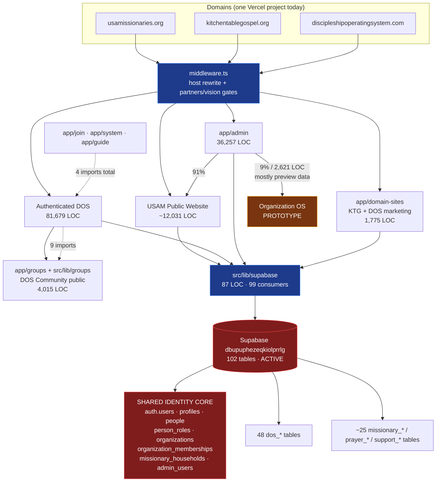

# Target Repository Architecture — Options, Scoring, Recommendation

**Date:** 2026-07-28 · Evidence base: `application-boundary-audit-2026-07.md`, `usam-website-route-inventory.md`, `database-ownership-map.md`.

---

## Founder Architecture Decision — Approved Direction

**Ruled 2026-07-28. Authoritative unless new evidence proves a ruling unsafe.** Where anything else in this document or its siblings disagrees, this section wins.

| # | Ruling |
|---|---|
| 1 | **Structured monorepo evolved in place.** `rfox0629/usam-website` becomes a platform repository of separately understandable, separately deployable applications. The exact folder layout is **not yet approved for migration** — it must be grounded in the current code and introduced incrementally. |
| 2 | **No new DOS repository.** DOS becomes a bounded app workspace inside the canonical repository. The repository may be referred to internally as "USAM Platform," but the GitHub name remains `rfox0629/usam-website` and is **not renamed now**. |
| 3 | **Organization OS is not ready for extraction.** No separate Organization OS repository. It is early infrastructure, previews, organization administration, communications, and planned functionality — not a cleanly extractable product. It must first be intentionally **defined and built** as an application boundary inside the monorepo. Repository extraction is revisited only if it later becomes sufficiently large, independent, and commercially or operationally justified. |
| 4 | **Kitchen Table Gospel stays** with the public web application for now. A small host-routed marketing surface. It may get its own app workspace later only if deployment, branding, or engineering ownership makes that useful. |
| 5 | **DOS marketing stays** with the public web application for now. Marketing and the authenticated product may gain separate deployment ownership later. No marketing pages move in this phase. |
| 6 | **The authenticated DOS application** should eventually become its own app workspace and stable Vercel boundary, **preserving existing production URLs wherever practical**. It does not move yet. |
| 7 | **Organization OS future scope** is directional, not an inventory of existing code: organizations, people/contacts, donors, volunteers, events, communications, newsletters, forms, finance, compliance, governance, payroll, reporting, document management, nonprofit administration, organization-specific access control. |
| 8 | **Legacy `USA-Missionaries/dos-platform`** remains a legacy reference only. Not canonical. Must not be revived. Approved direction: **preserve specific artifacts, then delete.** Deletion is **not** authorized yet. |
| 9 | **Database safety.** USA-100 must be resolved before database-sensitive application movement. USA-86 backup readiness must be sufficient before any migration-history repair or extraction involving schema ownership. No repairs, no migrations. |
| 10 | **Delivery rails** (USA-95–USA-99) remain important but are **not** in scope for architecture-preparation work. |

**This architecture decision approves no production change.** No route, domain, DNS, Vercel, Supabase, environment, authentication, or deployment change is authorized by it.

### What the rulings changed relative to the original audit

- The audit's conditional "graduation path" to a separate DOS repository is **withdrawn** (ruling 2).
- The audit recommended *not* extracting Organization OS because it barely exists. The ruling goes further and constructively: it must be **intentionally designed and built** as a boundary first. See `organization-os-product-boundary.md`.
- Kitchen Table Gospel and DOS marketing are confirmed as staying, with an explicit future option left open.

---

## Dependency graph



### Coupling classification

| Coupling | Classification |
|---|---|
| `src/lib/supabase` (87 LOC, 99 consumers) | **Healthy shared platform** — publish as a package |
| `middleware.ts` spanning domains + 2 gates | **Must remain shared** — single chokepoint |
| Shared identity core (8 tables) | **Must remain shared** — requires a database contract, never a split |
| `app/groups` ↔ `src/lib/groups` | **Healthy** — both are DOS |
| `app/join`/`app/system`/`app/guide` → DOS libs (4 imports) | **Acceptable temporary coupling** — trivially removable |
| `app/admin` mixing website + Org OS | **Must be extracted first** — the only genuine tangle |
| Undocumented Supabase env vars | **Migration blocker** — fix before any deployment split |
| USA-100 migration drift | **Migration blocker** — blocks all database work |
| Domain routing via one Vercel project | **Requires domain proxy/rewrites** if ever split |

## Options

### Option A — Keep everything in `rfox0629/usam-website`
Zero migration cost, one deploy, one database, one CI. But a 353k-LOC repository where 45% is a product that has nothing to do with the website; a new engineer must read everything to change anything; every DOS deploy risks the public site; the 31 DOS test scripts gate website changes. Two-year outcome: continued accretion, onboarding becomes prohibitive, DOS cannot be licensed or demoed independently.

### Option B — Structured monorepo (evolved in place)
```
apps/usam-web/          (public website + KTG + DOS marketing route groups)
apps/dos-app/           (authenticated DOS + Community + guide/review/testimony)
apps/admin/             (shared back-office; Org OS lives here until it is real)
packages/database/      (src/lib/supabase + generated types + table-ownership docs)
packages/ui/            (design system, nav, footer, forms)
packages/auth/          (access gates, admin-auth, session helpers)
packages/config/        (tailwind, tsconfig, eslint bases)
packages/testing/       (regression harness for the 39 scripts)
```
The current repository **can** be evolved into this — Next.js 16 + npm workspaces + Turborepo, no framework change. Vercel supports one project per app via distinct root directories, so **deployment independence is achieved without repository separation**. CODEOWNERS becomes genuinely meaningful (`/apps/dos-app/ @dos-owner`). Build cache makes CI faster, not slower. Rollback: each stage is a directory move plus import-path update, revertible by `git revert`.

### Option C — Separate repositories
`usam-website`, `dos-app`, `organization-os`, plus the existing four. Maximum deployment and CI independence. But with **one developer and one shared database**: shared packages need publishing and versioning, cross-cutting changes need coordinated PRs across repos, the 8-table identity contract is enforced by convention across repo boundaries, and dependency updates multiply by repo count. Duplicate-code risk is high precisely because publishing friction encourages copy-paste.

### Option D — Hybrid
Public/marketing monorepo + DOS in its own repository + Organization OS in its own repository + shared contract package + automation separate. This is the founder's stated expectation. It is directionally right about DOS and **wrong about Organization OS**, which is ~2,621 LOC of largely preview UI — there is no product to extract.

## Scoring

**Weighting assumptions (stated explicitly):** one founder-developer plus AI agents; no engineers hired yet; nonprofit cost sensitivity; a single shared production database that will not be split; DOS is the plausible future licensing/SaaS asset; safety and reversibility outrank theoretical purity. Weights: Safety ×3, Migration difficulty ×3, Founder usability ×3, AI-agent usability ×2, Long-term maintainability ×2, Clarity ×2, Deployment independence ×2, Database compatibility ×2, Suitability for future engineers ×2, DOS licensing suitability ×2, Rollback simplicity ×2, everything else ×1.

Raw scores 1–5 (5 best):

| Criterion | Wt | A | B | C | D |
|---|---:|---:|---:|---:|---:|
| Clarity | 2 | 1 | 5 | 4 | 4 |
| Safety | 3 | 4 | 4 | 2 | 2 |
| Migration difficulty (5 = easiest) | 3 | 5 | 4 | 1 | 2 |
| Developer experience | 1 | 2 | 5 | 3 | 3 |
| Deployment independence | 2 | 1 | 4 | 5 | 5 |
| Database compatibility | 2 | 5 | 5 | 3 | 3 |
| Long-term maintainability | 2 | 1 | 5 | 4 | 4 |
| Founder usability | 3 | 3 | 5 | 2 | 3 |
| AI-agent usability | 2 | 2 | 5 | 3 | 3 |
| Cost | 1 | 5 | 5 | 3 | 4 |
| Operational overhead | 1 | 4 | 4 | 2 | 2 |
| Rollback simplicity | 2 | 5 | 4 | 2 | 2 |
| Suitability for future engineers | 2 | 1 | 5 | 5 | 5 |
| Suitability for multiple organizations | 1 | 2 | 4 | 4 | 4 |
| DOS licensing / SaaS expansion | 2 | 1 | 4 | 5 | 5 |
| Ministry-specific branding | 1 | 3 | 5 | 4 | 4 |
| Risk of accidental cross-app changes (5 = lowest risk) | 2 | 1 | 4 | 5 | 5 |
| **Weighted total (max 170)** | | **91** | **147** | **106** | **114** |

Option A wins only on migration difficulty and rollback — the scores of doing nothing. Option C loses on the criteria that actually bind a one-developer team. **Option B wins decisively and is not close.**

## Recommendation

### Adopt Option B — a structured monorepo evolved in place from `rfox0629/usam-website`.

> **Superseded by founder ruling.** An earlier draft of this section described "a documented graduation path to Option C for DOS alone." That is **not** an approved direction. Founder ruling 2 (2026-07-28) prohibits creating a separate DOS repository. Any future reconsideration would require a new, explicit founder decision and is out of scope for every stage in this plan. See "Founder Architecture Decision — Approved Direction" below.

Answers to the Phase 8 questions:

1. **Should DOS leave `usam-website`?** Yes — but into an **app workspace**, not a separate repository, in this phase. It is 45% of the repo, self-contained, one-way coupled, and carries its own 31-script test suite.
2. **Should Organization OS leave?** **No.** It is ~2,621 LOC of largely preview data. Extracting it would be architecture theater. Build it before you move it.
3. **Should Kitchen Table Gospel stay with the public website?** **Yes.** 6 files, host-rewrite. Separating it buys nothing and costs a DNS cutover.
4. **DOS marketing — website or product?** **Website.** It is marketing, shares the website's design system, and is served by the same rewrite. Keeping it with the public site keeps the DOS app free of anonymous-traffic concerns.
5. **Monorepo?** Yes.
6. **Separate repositories?** **No.** Founder ruling 2 prohibits a new DOS repository, and ruling 3 prohibits a new Organization OS repository. Both become app workspaces inside the canonical repository.
7. **Repository names?** Keep `rfox0629/usam-website`. Founder ruling 2: the repository is **not renamed**, now or as part of any stage in this plan. It may be referred to internally as "USAM Platform," but that is a naming convention in prose only — the GitHub repository name does not change. Never reuse the name `dos-platform`.
8. **Who owns them?** `@rfox0629` until engineers exist. CODEOWNERS then splits per `apps/` directory.
9. **Which GitHub organization?** Stay on `rfox0629` for now.
10. **All canonical repos under `rfox0629`?** Yes.
11. **When would moving to `USA-Missionaries` make sense?** When a second person needs durable access independent of Ryan's personal account, or when the board requires organizational asset ownership. Move all canonical repos at once, not piecemeal. The org currently exposes no usable teams, which is the prerequisite to fix first.
12. **`USA-Missionaries/dos-platform`?** Archive it on GitHub now (it is currently **not** archived), preserve the 11 spec documents plus the In Season and scheduling source, then delete. See `dos-platform-legacy-audit.md`.
13. **The deleted `usam-dashboard` concept?** Correctly retired. Its Vercel project and paused Supabase project still exist and are orphaned — USA-96 scope. Registry v2's `Organization OS` record still points at the deleted repository and **must be corrected**.
14. **Organization OS in Linear?** Keep the Application label, but retarget it from the deleted `usam-dashboard` to `rfox0629/usam-website`. Represent it as a **future project**, not an active application.
15. **Application label changes?** One correction and one addition. Correct `Organization OS` → `rfox0629/usam-website`. The registry's `linearApplication` for `usam-website` must read `"USAM Website"` (it currently reads `"USAM Web"`, which does not match the live label).
16. **Vercel mapping?** `usam-website` → `apps/usam-web`; new `dos-app` project → `apps/dos-app` on `app.discipleshipoperatingsystem.com`; retire `thelordsarmy-website`, `usam-dashboard`, and the two per-ticket preview projects.
17. **CODEOWNERS evolution?** Rewrite around `apps/` and `packages/`. Fix the last-match-wins ordering defect in `save-website` and `stewardship.capital` first.
18. **CI evolution?** Turborepo affected-graph so a website change does not run 31 DOS regression scripts. Per-app required checks.
19. **Supabase ownership documentation?** `database-ownership-map.md` becomes the contract; add a per-table `OWNER:` comment convention in new migrations; keep the `dos_*` prefix as the namespace.
20. **What must happen before extraction begins?** USA-86 verified restore; USA-100 drift resolved; `.env.example` completed with the Supabase variables; the `app/admin` website/Org-OS tangle separated; USA-95/96 complete.
